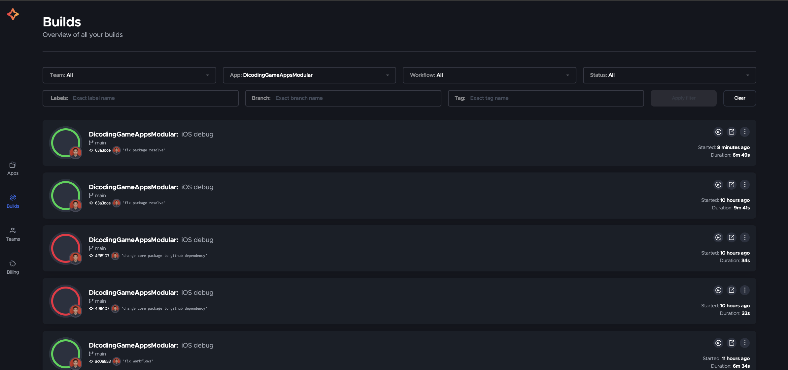
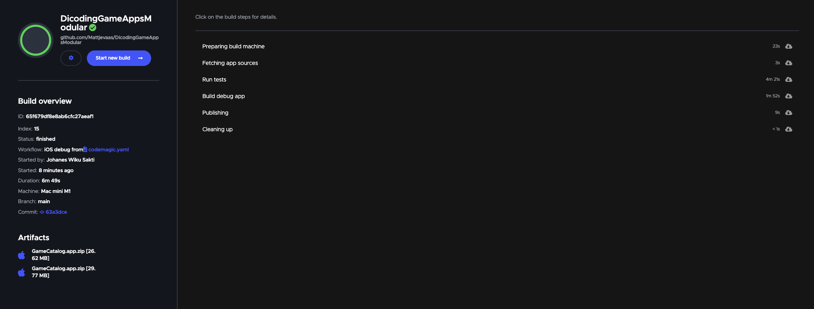

# DICODING GAME APP MODULARIZATION

migration from original repo: https://github.com/Mattjevaas/DicodingGameAppsModularization.git

Core modular package repository: https://github.com/Mattjevaas/GameModularCorePackage

reason of migration: **Change Cocoapods to Swfit Package Manager**

## Codemagic build screenshot

